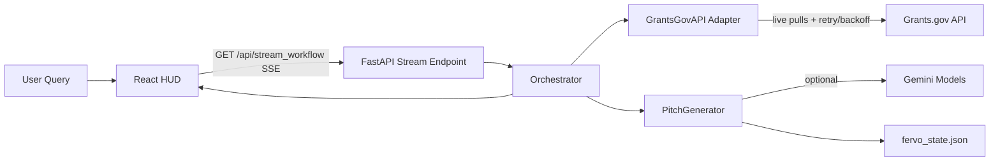

# Architecture

## System Overview

The application is a two-tier system:

- Backend orchestrator (`FastAPI` + async pipeline)
- Frontend HUD (`React` + SSE terminal/dashboards)

The UI is phase-driven and intentionally narrative:

1. Hunt: stream internal cognition events.
2. Lock: render final target + proposal package.
3. Deploy: simulate swarm dispatch with audit feedback.

## High-Level Diagram

## Backend Components

### `backend/main.py`

Responsibilities:
- Exposes `GET /health`.
- Exposes `GET /api/stream_workflow`.
- Applies stream auth verification.
- Applies per-client rate limiting.
- Enforces max concurrent stream handlers via `asyncio.Semaphore`.
- Configures CORS for local frontend origins.

### `backend/orchestrator.py`

Responsibilities:
- Runs autonomous workflow as an async generator.
- Emits SSE envelopes (`monologue`, `vad`, `grant_candidate`, `pitch`, `error`, `done`).
- Handles fatal exceptions and emits a reference `error_id`.

Workflow stages:
- `init`
- `fetch_grants`
- `gemini_filter`
- `generate_pitch`

### `backend/grants_gov_api.py`

Responsibilities:
- Query expansion with Gemini (`_expand_search_keywords`) when enabled.
- Parallel fan-out via `asyncio.gather`.
- Live search on Grants.gov `search2`.
- Retry with backoff + jitter for retryable status codes.
- Status filter hard-scope: `oppStatuses=forecasted|posted`.
- Deduplication by `opportunity_number`.
- Optional contact email enrichment from `fetchOpportunity`.
- Synthetic fallback generation when live or parse paths fail.

### `backend/pitch_generator.py`

Responsibilities:
- Optional Gemini-assisted grant filtering.
- Pitch generation with strict v2 payload schema:
  - `pitch_draft`
  - `feasibility_score`
  - `swarm_tasks`
- Loads company runtime context from `fervo_state.json`.
- Enforces assignees against declared `swarm_nodes`.
- Applies template fallback when model unavailable/error.

### `backend/pydantic_models.py`

Typed contracts for:
- grants (`GrantOpportunity`)
- company state (`CompanyState`, `SwarmNode`)
- proposal payload (`PitchResult`, `FeasibilityScore`, `SwarmTask`)
- generic stream envelope (`StreamEnvelope`)

## Frontend Components

### `frontend/src/hooks/useTreasuryStream.ts`

Responsibilities:
- Open/close `EventSource`.
- Translate SSE payloads into React state.
- Maintain stream status lifecycle:
  - `idle -> connecting -> connected -> completed|error`
- Surface protocol and connectivity failures.
- Apply connection open timeout fail-fast (`12s`).

### `frontend/src/App.tsx`

Responsibilities:
- Render mission HUD bar.
- Render phase-based UI mounts:
  - Hunt: telemetry-only.
  - Locked/idle: full dashboard.
- Show feasibility matrix + swarm task cards.
- Simulate deploy action latency and emit audit UI feedback.

## Key Design Decisions

1. SSE over WebSockets
- Stream is server-to-client only; SSE keeps complexity low.

2. Deterministic fallback mode
- Demo reliability is protected when external services fail.

3. Stateful swarm context
- `fervo_state.json` is loaded at runtime and injected into prompts.

4. Strong schema discipline
- Model payload is parsed and validated via Pydantic contracts.

5. Controlled cognitive narrative
- UI phases intentionally guide attention under demo pressure.
